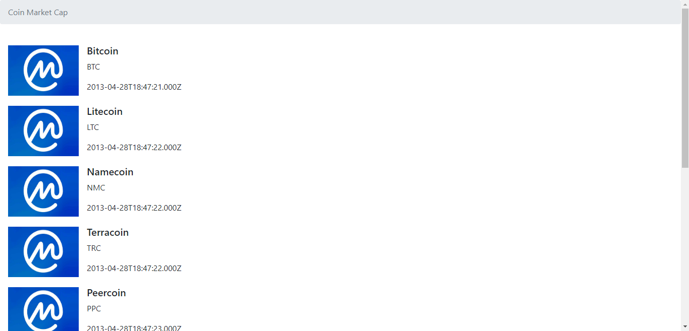
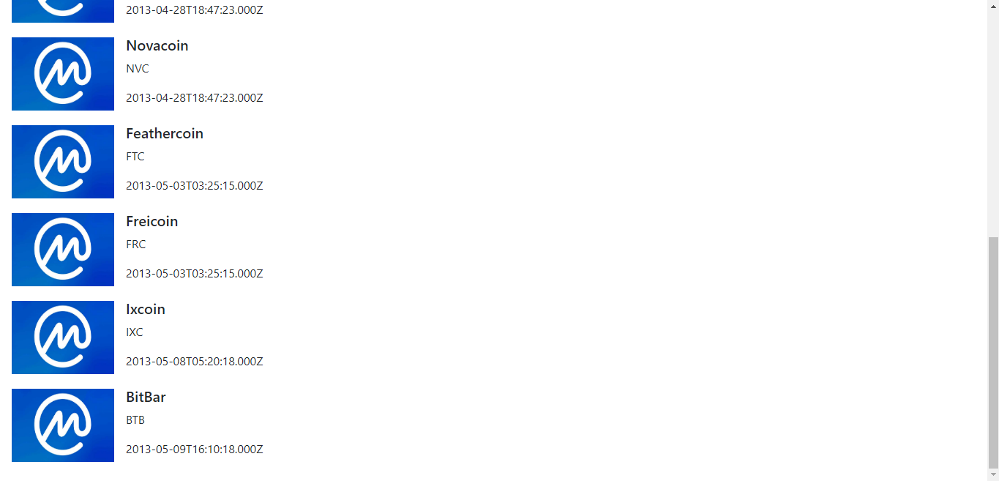
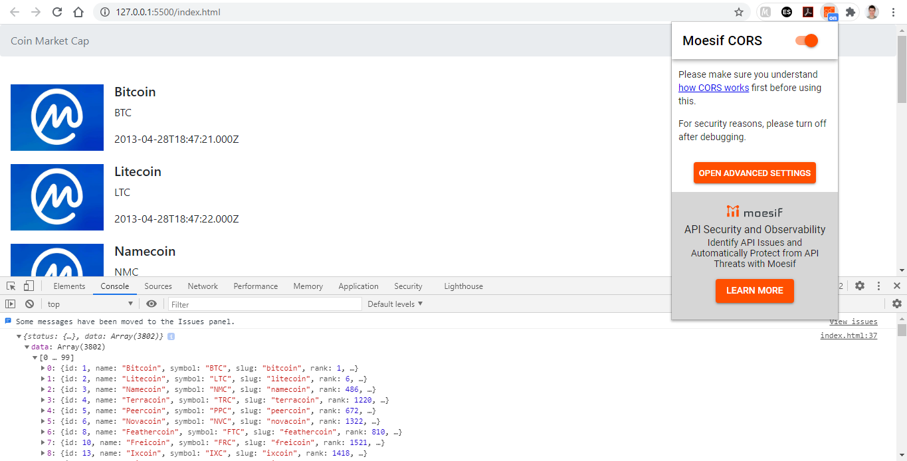
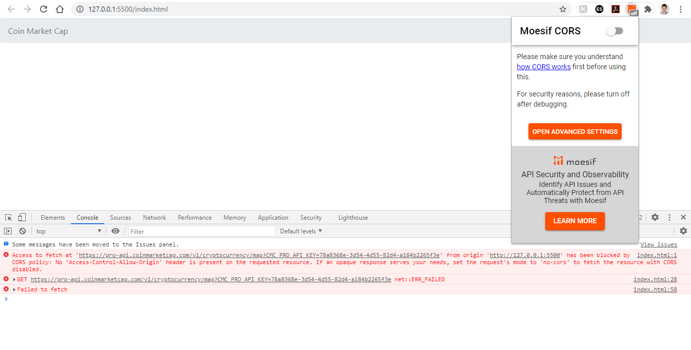

[](https://github.com/marioandre01)
[](#)
[](https://github.com/marioandre01/requisitando_API_de_criptomoedas-dio/stargazers)
[](https://github.com/marioandre01/requisitando_API_de_criptomoedas-dio/network/members)
[](https://github.com/marioandre01/requisitando_API_de_criptomoedas-dio/graphs/contributors)
[](https://github.com/marioandre01/requisitando_API_de_criptomoedas-dio/blob/master/LICENCE.md)


<h1 align="center">
    Requisitando API de criptomoedas - DIO
</h1>

<p align="center"> 
  <a href="#-projeto">Projeto</a>&nbsp;&nbsp;&nbsp;|&nbsp;&nbsp;&nbsp;
  <a href="#-tecnologias">Tecnologias</a>&nbsp;&nbsp;&nbsp;|&nbsp;&nbsp;&nbsp;
  <a href="#-layout">Layout</a>&nbsp;&nbsp;&nbsp;|&nbsp;&nbsp;&nbsp;
  <a href="#-executando-a-aplicação">Executando a aplicação</a>&nbsp;&nbsp;&nbsp;|&nbsp;&nbsp;&nbsp;
  <a href="#gear-contribuição">Contribuição</a>&nbsp;&nbsp;&nbsp;|&nbsp;&nbsp;&nbsp;
  <a href="#memo-licença">Licença</a>
</p>

## 💻 Projeto

Esse projeto foi desenvolvido através do [bootcamp everis Fullstack Developer](https://web.digitalinnovation.one/track/everis-fullstack-developer) oferecido pela empresa Everis em parceria com a [Digital Innovation One - DIO](https://digitalinnovation.one/), um dos maiores ecossistema open education da América Latina. 

O projeto teve como objetivo aprender como é feito uma requisição em uma API. Nessa proposta o acesso foi feito usando a biblioteca fetch do javascript, requisitando a API do coinmarketcap. Para ter acesso aos dados da API é necessário criar uma conta no site da [coinmarketcap](https://pro.coinmarketcap.com/account/) e copiar a chave fornecida ao usuário, e colocar na URL de requisição. Para que a requisição ocorra corretamente deve-se instalar o plugin [Moesif Origin & CORS Changer](https://chrome.google.com/webstore/detail/moesif-origin-cors-change/digfbfaphojjndkpccljibejjbppifbc) no Chrome. Se não ativar o plugin a resposta da requisição não vai ser permitida devido ao mecanismo de CORS (Cross-origin Resource Sharing). Com os dados recebidos, foi acessados as informações de "name", "symbol" e "first_historical_data" e se mostrou na página. Para a parte visual da página se usou o framework CSS bootstrap via URL.

## 📋 Tecnologias

O projeto foi desenvolvido com as seguintes tecnologias:

- HTML
- CSS
- Javascript
- Fetch - Fazer requisição em APIs
- [BootstrapCDN](https://www.bootstrapcdn.com/)
- [Moesif Origin & CORS Changer](https://chrome.google.com/webstore/detail/moesif-origin-cors-change/digfbfaphojjndkpccljibejjbppifbc)
- [coinmarketcap](https://pro.coinmarketcap.com/account/) - Criar uma conta para pegar a chave que permite acesso a API.
- [Documentação API](https://coinmarketcap.com/api/documentation/v1/#)

## 🎨 Layout

<p align="center">
  
  
</p>

## 💻 Executando a aplicação

### Requisitos necessários

Para executar o projeto é necessário ter:
- Navegador web
- Plugin Moesif Origin & CORS Changer instalado no Chrome e ativado. Se não ativar o plugin a resposta da requisição não vai ser permitida devido ao mecanismo de CORS (Cross-origin Resource Sharing).
<p align="center">
  
  
</p>

### :octocat: Clonando o Repositório

```bash
$ git clone https://github.com/marioandre01/requisitando_API_de_criptomoedas-dio.git

# entre na pasta do projeto
$ cd requisitando_API_de_criptomoedas-dio
```
### 💻 Executando a aplicação

Abra o arquivo index.html

## :gear: Contribuição

Para contribuir com esse projeto faça os seguintes passos:

- Faça um fork desse repositório;
- Crie uma branch com a sua feature: `git checkout -b minha-feature`;
- Faça commit das suas alterações: `git commit -m 'feat: Minha nova feature'`;
- Faça push para a sua branch: `git push origin minha-feature`.

## :memo: Licença

Esse projeto está sob a licença MIT. Veja o arquivo [LICENCE](./LICENCE.md) para mais detalhes.